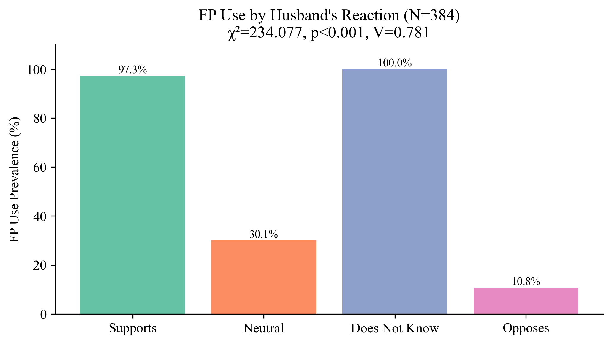
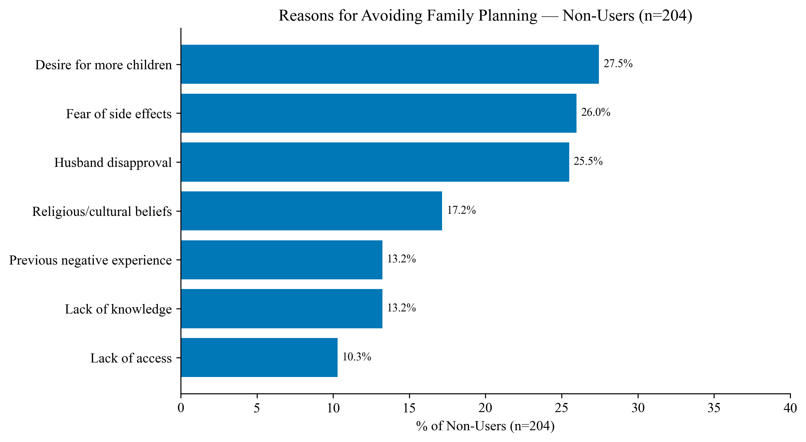
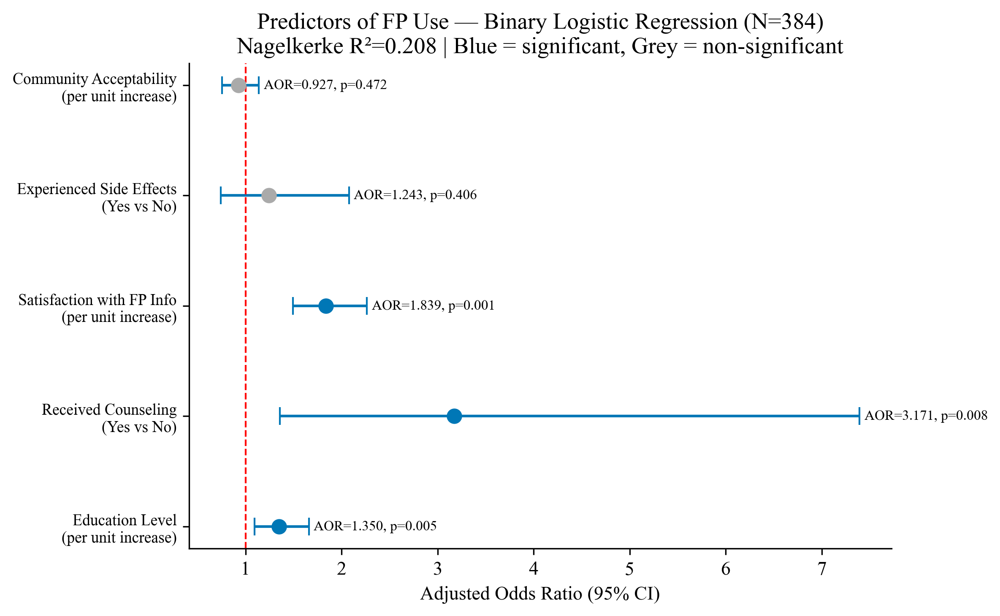

# Family Planning Among Married Women of Reproductive Age in Kassala City

## Kassala, Sudan – 2025

**Study type:** Cross-sectional descriptive study (mixed methods)
**Degree level:** MD (Family Medicine, Sudan Medical Specializations Board)
**Institution:** Primary healthcare centres, Kassala City
**Sample size:** N = 384 married women of reproductive age (15–45 years)
**Data analyst:** Abdulrahman Sirelkhatim

---

## Background

Access to family planning services is a cornerstone of reproductive health and a key determinant of
maternal and child outcomes. In Sudan, the total fertility rate remains high and contraceptive
prevalence is below regional targets, with significant variation across states. Kassala — a city in
eastern Sudan that has absorbed large numbers of internally displaced persons and refugees from
neighbouring conflict zones — represents a setting where reproductive health services face compounding
pressures from population growth, resource constraints, and deep-rooted social norms.

Understanding the factors that drive or inhibit family planning uptake in this setting requires
attention not only to structural factors such as service availability, but also to the social and
relational dynamics that shape women's contraceptive behaviour — particularly the role of husbands,
religious leaders, and community norms. This study examines FP utilization patterns, spousal and
community influences, information quality, and barriers to uptake among married women of reproductive
age in Kassala City.

A mixed-methods approach was employed: quantitative data were analyzed via SPSS, and four open-ended
questions were analyzed thematically. The qualitative findings are documented in
`6_docs/qualitative_analysis.md` and integrated into the results narrative.

## Objectives

- Estimate the prevalence of current family planning use
- Describe the distribution of contraceptive methods used
- Identify sociodemographic, spousal, and community-level factors associated with FP use
- Examine satisfaction with FP information, side effect experiences, and counselling coverage
- Analyze thematically the reasons for method choice, spousal opposition, side effects reported,
  and general concerns about FP

## Study Design & Methods

| Component | Detail |
|-----------|--------|
| Design | Cross-sectional, facility-based descriptive (mixed methods) |
| Setting | Primary healthcare centres, Kassala City, Sudan |
| Population | Married women aged 15–45 attending PHC facilities during study period |
| Sampling | Convenience sampling |
| Sample size | N = 384 |
| Data collection | Self-administered structured questionnaire with four open-ended items |
| Qualitative analysis | Thematic analysis of open-ended responses |

**Technical suite:**

| Tool | Purpose |
|------|---------|
| Python (pandas, numpy) | Data cleaning, multi-select dummy coding, ordinal recoding |
| IBM SPSS Statistics v26 | Quantitative statistical analysis |
| Python (matplotlib, seaborn, scipy) | Figure generation |
| Jupyter Notebook | Exploratory data analysis |

**Statistical methods:**

- **Descriptive:** Frequencies, percentages, means, SDs
- **Bivariate:** Chi-square with Cramer's V (categorical predictors of FP use), risk estimate OR
  for counselling, Spearman and Pearson correlations (satisfaction vs. FP use)
- **Multivariate:** Binary logistic regression (Enter method) — predictors of current FP use
- **Qualitative:** Thematic analysis of four open-ended questions (n = 384 responses)

## Dataset

| File | Description |
|------|-------------|
| `1_data/raw/raw.xlsx` | Raw questionnaire responses (N=384, 20 columns including open-ended) |
| `1_data/cleaned/cleaned_data.xlsx` | Cleaned quantitative dataset: recoded variables, dummy-coded multi-select items, composite scores |
| `1_data/cleaned/qualitative_data.xlsx` | Open-ended responses separated for thematic analysis |

> **Note:** No individual identifiers are present. Raw data excluded from version control.

## Repository Structure

```text
family-planning-married-women-kassala-2025/
│
├── README.md
├── .gitignore
├── .ls-lint.yml
├── .markdownlint.yml
├── .markdownlintignore
│
├── .github/
│   └── workflows/
│       └── ci-checks.yml
│
├── 1_data/
│   ├── raw/                        ← excluded from version control (privacy)
│   └── cleaned/
│       ├── cleaned_data.xlsx
│       └── qualitative_data.xlsx
│
├── 2_cleaning/
│   └── cleaning.py
│
├── 3_notebooks/
│   └── exploratory_analysis.ipynb
│
├── 4_analysis/
│   ├── full_analysis.sps
│   └── figures.py
│
├── 5_figures/
│   └── (18 figures)
│
└── 6_docs/
    ├── results_chapter.docx
    └── qualitative_analysis.md
```

## Key Results

### Family Planning Prevalence and Methods

**46% of participants (n = 174) were currently using a family planning method.**

The most common methods were oral contraceptive pills (32.2%) and injectables (29.9%), followed
by implants (14.9%), other methods (12.1%), IUDs (6.9%), and condoms (5.7%). The predominance
of hormonal methods — particularly injectables and implants — is clinically significant as these
carry the highest risk of menstrual irregularities, the most commonly reported side effect in this sample.

### Spousal and Community Dynamics

Among the 335 women with a known spousal attitude, 29.4% reported their husband supported FP,
32.8% described him as neutral, 19.8% said he opposed it, and 5.2% said he was unaware. This
means approximately one in five women with a known spousal attitude faced active opposition.

Community acceptability remained a barrier: only 15.4% perceived FP as very acceptable in their
community, while 30.2% considered it not acceptable.

### Counselling, Side Effects, and Satisfaction

- 88.0% had received FP counselling from a health worker
- 25.3% had experienced side effects at some point
- 62.2% were satisfied or very satisfied with FP information received
- 20.3% expressed some degree of dissatisfaction

### Qualitative Findings (Summary)

Thematic analysis of the four open-ended questions revealed:

| Question | Key Finding |
|----------|-------------|
| Why did you choose this method? | Availability/convenience (25%); husband decided (~10%) |
| Husband's opposition concerns | Religious prohibition (31%), infertility fear (25%), health harm (28%) |
| Side effects experienced | Menstrual disturbances (39%); 4 unexpected pregnancies during use |
| General FP concerns | 57% no concerns; infertility fear (8%), cancer fear (3%) |

### Bivariate Analysis

| Variable | χ² | p-value | Cramer's V |
|----------|-----|---------|-----------|
| Husband's reaction | 234.077 | < 0.001 | 0.781 (very strong) |
| Satisfaction with FP info | 68.755 | < 0.001 | 0.423 |
| Main influencer | 49.476 | < 0.001 | 0.359 |
| Community acceptability | 45.218 | < 0.001 | 0.343 |
| Occupation | 23.853 | < 0.001 | 0.249 |
| Received counselling | 16.441 | < 0.001 | 0.207 |
| Education level | 9.818 | 0.020 | 0.160 |
| Age group | 4.569 | 0.102 | ns |
| Experienced side effects | 0.517 | 0.472 | ns |

The strongest predictor was husband's reaction (V = 0.781). Among women whose husbands were
supportive, **96.5%** were current users. This fell to 29.4% for neutral husbands, 10.5% for
those facing opposition, and 0% for those whose husbands were unaware — a dramatic gradient
confirming spousal attitude as the dominant contextual determinant of contraceptive behavior.

Spearman correlation: satisfaction with FP information vs. FP use (ρ = 0.330, p < 0.001).

### Multivariate Analysis — Binary Logistic Regression

**Model fit:** χ²(5) = 64.960, p < 0.001; Nagelkerke R² = 0.208; correct classification = 66.1%

| Predictor | AOR | 95% CI | p-value |
|-----------|-----|--------|---------|
| Education level (per unit) | 1.350 | 1.096–1.661 | 0.005 |
| Received counselling (Yes) | 3.171 | 1.360–7.393 | 0.008 |
| Satisfaction with FP info (per unit) | 1.839 | 1.493–2.264 | < 0.001 |
| Experienced side effects (Yes) | 1.243 | 0.744–2.078 | 0.406 (ns) |
| Community acceptability (per unit) | 0.927 | 0.754–1.140 | 0.472 (ns) |

After adjustment, **education, receipt of counselling, and satisfaction with information** were
independent predictors. Each increase in satisfaction score nearly doubled the odds of FP use
(AOR = 1.839). Women who received counselling were more than three times as likely to be current
users. Notably, community acceptability lost significance in the adjusted model, suggesting its
bivariate effect is mediated by other variables.

## Selected Figures

**FP Use by Husband's Reaction**


**Avoidance Reasons Among Non-Users**


**Logistic Regression Forest Plot**


## Limitations

- **Convenience sampling:** Participants were recruited from PHC attendees, which may overrepresent
  women with prior health system contact and underrepresent those who never seek care.
- **Social desirability bias:** FP use and spousal attitudes are sensitive topics; self-reported
  responses may not reflect actual behavior.
- **Cross-sectional design:** Causal direction between predictors and FP use cannot be established.
- **Hosmer–Lemeshow significance:** The logistic regression Hosmer–Lemeshow test was significant
  (p = 0.008), indicating imperfect model fit. Results should be interpreted with appropriate caution.
- **Husband's reaction not recorded for 49 participants:** The missing responses introduce a
  potential source of selection bias in the spousal analysis.

## Files

| Script | Purpose |
|--------|---------|
| `2_cleaning/cleaning.py` | Drops admin columns, renames fields, recodes demographics, dummy-codes multi-select items (methods, encouragement, avoidance), computes composite scores |
| `4_analysis/figures.py` | All 18 figures reading from cleaned data |
| `4_analysis/full_analysis.sps` | SPSS syntax: descriptives, Spearman/Pearson correlations, chi-square, logistic regression |
| `3_notebooks/exploratory_analysis.ipynb` | EDA: data quality, demographics, FP patterns, key associations |
| `6_docs/qualitative_analysis.md` | Thematic analysis of four open-ended questions |

---

**Data analyst:** *Abdulrahman Sirelkhatim | Analysis conducted March 2026*
